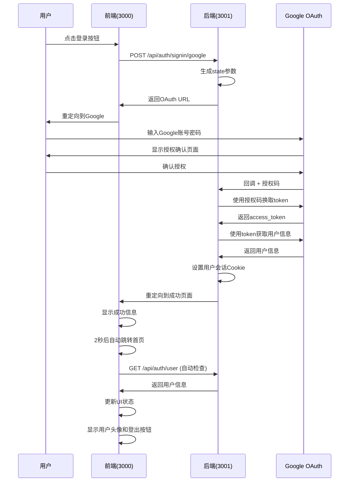

# OAuth认证流程完整文档

## 📋 目录
- [概述](#概述)
- [系统架构](#系统架构)
- [完整流程图](#完整流程图)
- [详细流程说明](#详细流程说明)
- [API接口文档](#api接口文档)
- [错误处理](#错误处理)
- [安全机制](#安全机制)
- [部署配置](#部署配置)

## 🎯 概述

本文档详细描述了Sino Name项目的Google OAuth认证流程，包括前端、后端、Google OAuth服务之间的完整交互过程。

### 技术栈
- **前端**: Next.js 15 + React + TypeScript
- **后端**: Node.js + Express (端口3001)
- **认证**: Google OAuth 2.0
- **状态管理**: Custom Hook + Context
- **存储**: HttpOnly Cookies

## 🏗️ 系统架构

```
┌─────────────┐    ┌─────────────┐    ┌─────────────┐
│   前端      │    │   后端      │    │   Google   │
│ (端口3000)  │◄──►│ (端口3001)  │◄──►│   OAuth    │
└─────────────┘    └─────────────┘    └─────────────┘
       │                   │                   │
       │                   │                   │
       ▼                   ▼                   ▼
┌─────────────┐    ┌─────────────┐    ┌─────────────┐
│  用户界面   │    │  OAuth回调  │    │  授权页面   │
│  状态管理   │    │  会话管理   │    │  令牌交换   │
└─────────────┘    └─────────────┘    └─────────────┘
```

## 🔄 完整流程图



## 📖 详细流程说明

### 阶段1: 用户发起登录
1. 用户在首页点击"Login"按钮
2. 前端调用`useAuth.login()`函数
3. 发送POST请求到后端登录接口

### 阶段2: 后端生成OAuth URL
1. 后端验证请求方法
2. 生成CSRF保护的state参数
3. 构建Google OAuth授权URL
4. 设置state cookie
5. 返回授权URL给前端

### 阶段3: 用户Google授权
1. 前端重定向到Google OAuth页面
2. 用户输入Google账号密码
3. Google显示应用授权确认页面
4. 用户确认授权

### 阶段4: Google回调处理
1. Google重定向到后端回调地址
2. 携带授权码(code)和state参数
3. 后端验证state参数防止CSRF攻击
4. 使用授权码换取访问令牌

### 阶段5: 获取用户信息
1. 后端使用access_token调用Google API
2. 获取用户基本信息(姓名、邮箱、头像)
3. 创建用户会话数据
4. 设置HttpOnly Cookie

### 阶段6: 重定向到成功页面
1. 后端重定向到前端成功页面
2. URL中包含编码的用户信息
3. 前端解析并显示用户信息
4. 2秒后自动跳转回首页

### 阶段7: 状态同步
1. 首页useAuth Hook自动检查登录状态
2. 调用GET /api/auth/user接口
3. 后端验证Cookie并返回用户信息
4. 前端更新UI状态

## 🔌 API接口文档

### 1. 登录接口

#### **POST /api/auth/signin/google**
启动Google OAuth登录流程

**请求头:**
```bash
Content-Type: application/json
```

**请求体:**
```json
{}
```

**curl示例:**
```bash
curl -X POST http://localhost:3000/api/auth/signin/google \
  -H "Content-Type: application/json" \
  -d '{}'
```

**响应示例:**
```json
{
  "success": true,
  "redirectUrl": "https://accounts.google.com/oauth/authorize?client_id=...&redirect_uri=...&response_type=code&scope=openid%20email%20profile&state=...",
  "message": "OAuth授权URL已生成"
}
```

### 2. OAuth回调接口

#### **GET /api/auth/callback/google**
处理Google OAuth回调

**查询参数:**
- `code`: 授权码
- `state`: CSRF保护参数
- `error`: 错误信息(可选)

**curl示例:**
```bash
curl "http://localhost:3001/api/auth/callback/google?code=AUTHORIZATION_CODE&state=CSRF_STATE"
```

**响应:**
- 成功: 重定向到前端成功页面
- 失败: 重定向到前端错误页面

### 3. 用户信息接口

#### **GET /api/auth/user**
获取当前登录用户信息

**请求头:**
```bash
Cookie: user_session=SESSION_COOKIE_VALUE
```

**curl示例:**
```bash
curl -X GET http://localhost:3000/api/auth/user \
  -H "Cookie: user_session=SESSION_COOKIE_VALUE"
```

**响应示例:**
```json
{
  "success": true,
  "user": {
    "id": "123456789",
    "name": "张三",
    "email": "zhangsan@gmail.com",
    "picture": "https://lh3.googleusercontent.com/..."
  }
}
```

**未登录响应:**
```json
{
  "success": false,
  "error": "未找到用户会话"
}
```

### 4. 登出接口

#### **POST /api/auth/logout**
用户登出

**请求头:**
```bash
Content-Type: application/json
Cookie: user_session=SESSION_COOKIE_VALUE
```

**请求体:**
```json
{}
```

**curl示例:**
```bash
curl -X POST http://localhost:3000/api/auth/logout \
  -H "Content-Type: application/json" \
  -H "Cookie: user_session=SESSION_COOKIE_VALUE" \
  -d '{}'
```

**响应示例:**
```json
{
  "success": true,
  "message": "登出成功"
}
```

### 5. OAuth错误信息接口

#### **GET /api/auth/oauth-error**
获取OAuth错误详细信息

**查询参数:**
- `error`: 错误代码
- `message`: 错误描述

**curl示例:**
```bash
curl "http://localhost:3000/api/auth/oauth-error?error=invalid_grant&message=授权码已过期"
```

**响应示例:**
```json
{
  "success": false,
  "error": {
    "error": "invalid_grant",
    "message": "OAuth授权码已过期或无效，请重新登录",
    "timestamp": 1640000000000,
    "suggestions": [
      "OAuth授权码已过期，请重新登录",
      "检查系统时间是否正确",
      "清除浏览器缓存和Cookie",
      "重新启动浏览器",
      "如果问题持续，请联系技术支持"
    ]
  }
}
```

## 🚨 错误处理

### 常见错误类型

| 错误代码 | 错误描述 | 解决方案 |
|----------|----------|----------|
| `invalid_grant` | 授权码已过期或无效 | 重新登录 |
| `access_denied` | 用户拒绝授权 | 重新授权 |
| `redirect_uri_mismatch` | 重定向URI不匹配 | 检查Google Console配置 |
| `invalid_client` | 客户端配置错误 | 检查环境变量 |
| `server_error` | 服务器内部错误 | 稍后重试 |

### 错误页面流程
```
OAuth错误 → 后端错误处理 → 重定向到/oauth-error → 显示错误信息 → 提供解决建议
```

## 🔒 安全机制

### 1. CSRF保护
- 使用随机生成的state参数
- 验证回调中的state与cookie中的state是否匹配
- state cookie设置为HttpOnly和SameSite=Lax

### 2. 会话安全
- 用户会话存储在HttpOnly Cookie中
- Cookie数据使用Base64编码
- 设置合理的过期时间
- 支持SameSite=Lax防止CSRF

### 3. 环境变量保护
- 敏感信息存储在.env文件中
- .env文件被.gitignore忽略
- 提供env.example作为配置模板

## 🚀 部署配置

### 环境变量配置

创建`.env`文件:
```bash
# ==================== Google OAuth配置 ====================
GOOGLE_CLIENT_ID=your_google_client_id
GOOGLE_CLIENT_SECRET=your_google_client_secret

# ==================== NextAuth配置 ====================
NEXTAUTH_URL=https://your-domain.com
NEXTAUTH_SECRET=your_nextauth_secret

# ==================== 前端配置 ====================
FRONTEND_BASE_URL=https://your-domain.com

# ==================== 其他配置 ====================
NODE_ENV=production
```

### Google Console配置

1. **授权重定向URI**: `https://your-domain.com/api/auth/callback/google`
2. **JavaScript来源**: `https://your-domain.com`
3. **应用状态**: 发布或测试模式

### 生产环境注意事项

1. **HTTPS**: 必须使用HTTPS协议
2. **域名**: 确保域名配置正确
3. **Cookie**: 设置适当的Cookie安全属性
4. **日志**: 启用错误日志记录

## 📱 前端集成

### useAuth Hook使用

```typescript
import { useAuth } from '../hooks/useAuth';

const { user, loading, error, login, logout, isAuthenticated } = useAuth();

// 登录
const handleLogin = () => {
  login();
};

// 登出
const handleLogout = () => {
  logout();
};

// 显示用户信息
{isAuthenticated && user && (
  <div>
    
    <span>{user.name}</span>
    <button onClick={handleLogout}>登出</button>
  </div>
)}
```

### 页面路由

- `/oauth-success`: OAuth成功页面
- `/oauth-error`: OAuth错误页面
- `/`: 首页（根据登录状态显示不同内容）

## 🔍 调试和测试

### 测试OAuth流程

1. **启动服务**
```bash
# 前端
npm run dev

# 后端
cd ../braveray-backend
npm run dev
```

2. **测试登录流程**
```bash
# 测试登录接口
curl -X POST http://localhost:3000/api/auth/signin/google \
  -H "Content-Type: application/json" \
  -d '{}'
```

3. **检查用户状态**
```bash
# 检查用户接口
curl -X GET http://localhost:3000/api/auth/user
```

### 常见问题排查

1. **水合错误**: 检查国际化配置和状态管理
2. **重定向错误**: 验证Google Console配置
3. **Cookie问题**: 检查Cookie设置和域名配置
4. **网络错误**: 确认前后端服务状态

## 📝 更新日志

- **v1.0.0**: 初始OAuth实现
- **v1.1.0**: 添加错误处理和用户状态管理
- **v1.2.0**: 优化安全机制和用户体验
- **v1.3.0**: 完善文档和测试用例

---

## 📞 技术支持

如果遇到问题，请：
1. 检查环境变量配置
2. 查看浏览器控制台错误
3. 检查后端服务日志
4. 联系开发团队获取支持

---

*最后更新: 2024年8月18日*
*版本: v1.3.0*
