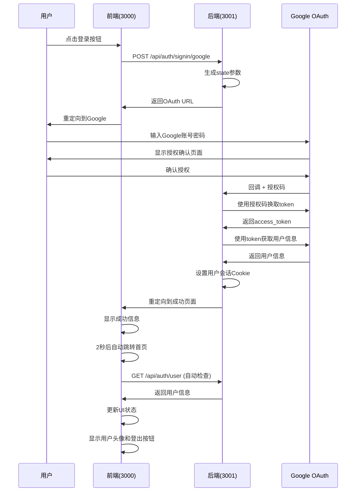

# Sino-Name 项目

## 🎯 项目简介

Sino-Name 是一个现代化的中文起名应用，采用前后端分离架构，提供完整的Google OAuth认证系统和用户管理功能。项目专注于用户体验和安全性，实现了自定义的OAuth流程。

## 🏗️ 系统架构

### 整体架构图
```
┌─────────────────────────────────────────────────────────────┐
│                        用户                                 │
└─────────────────────────────────────────────────────────────┘
                                │
                                ▼
┌─────────────────────────────────────────────────────────────┐
│                      前端服务                               │
│                    (端口3000)                              │
│  ┌─────────────────┐  ┌─────────────────┐  ┌─────────────┐ │
│  │   用户界面      │  │   状态管理      │  │   OAuth页面 │ │
│  │   (首页)        │  │   (useAuth)     │  │ (成功/错误) │ │
│  └─────────────────┘  └─────────────────┘  └─────────────┘ │
└─────────────────────────────────────────────────────────────┘
                                │
                                ▼
┌─────────────────────────────────────────────────────────────┐
│                      后端服务                               │
│                    (端口3001)                              │
│  ┌─────────────────┐  ┌─────────────────┐  ┌─────────────┐ │
│  │   OAuth登录     │  │   OAuth回调     │  │   用户管理  │ │
│  │   (生成URL)     │  │   (处理授权)     │  │  (会话管理) │ │
│  └─────────────────┘  └─────────────────┘  └─────────────┘ │
└─────────────────────────────────────────────────────────────┘
                                │
                                ▼
┌─────────────────────────────────────────────────────────────┐
│                    Google OAuth服务                         │
│  ┌─────────────────┐  ┌─────────────────┐  ┌─────────────┐ │
│  │   授权页面      │  │   令牌交换      │  │   用户信息  │ │
│  │   (用户登录)     │  │   (code→token)  │  │  (profile)  │ │
│  └─────────────────┘  └─────────────────┘  └─────────────┘ │
└─────────────────────────────────────────────────────────────┘
```

### 技术架构特点

1. **前后端分离**: 前端运行在3000端口，后端运行在3001端口
2. **自定义OAuth**: 完全自主实现的Google OAuth 2.0流程
3. **状态管理**: 使用React Hooks和Context API管理认证状态
4. **安全机制**: 实现CSRF保护、安全的Cookie管理和状态验证
5. **错误处理**: 完善的错误处理机制和用户友好的错误页面

## 🔐 OAuth认证系统

### 系统架构
```
┌─────────────┐    ┌─────────────┐    ┌─────────────┐
│   前端      │    │   后端      │    │   Google   │
│ (端口3000)  │◄──►│ (端口3001)  │◄──►│   OAuth    │
└─────────────┘    └─────────────┘    └─────────────┘
```

### 技术特点
- **自定义实现**: 完全自主实现的OAuth 2.0流程
- **前后端分离**: 前端(3000端口) + 后端(3001端口)
- **安全优先**: CSRF保护、状态验证、安全Cookie
- **用户体验**: 自动状态同步、智能重定向、错误处理

### 完整认证流程



### 详细流程说明

#### 阶段1: 用户发起登录
1. 用户在首页点击"Login"按钮
2. 前端调用`useAuth.login()`函数
3. 发送POST请求到后端登录接口

#### 阶段2: 后端生成OAuth URL
1. 后端验证请求方法
2. 生成CSRF保护的state参数
3. 构建Google OAuth授权URL
4. 设置state cookie
5. 返回授权URL给前端

#### 阶段3: 用户Google授权
1. 前端重定向到Google OAuth页面
2. 用户输入Google账号密码
3. Google显示应用授权确认页面
4. 用户确认授权

#### 阶段4: Google回调处理
1. Google重定向到后端回调地址
2. 携带授权码(code)和state参数
3. 后端验证state参数防止CSRF攻击
4. 使用授权码换取访问令牌

#### 阶段5: 获取用户信息
1. 后端使用access_token调用Google API
2. 获取用户基本信息(姓名、邮箱、头像)
3. 创建用户会话数据
4. 设置HttpOnly Cookie

#### 阶段6: 重定向到成功页面
1. 后端重定向到前端成功页面
2. URL中包含编码的用户信息
3. 2秒后自动跳转回首页

#### 阶段7: 状态同步
1. 首页useAuth Hook自动检查登录状态
2. 调用`GET /api/auth/user`接口
3. 更新UI状态，显示用户头像和登出按钮

## 🔌 API接口文档

### 认证接口

#### 1. 登录接口
```bash
POST /api/auth/signin/google
```
**功能**: 启动Google OAuth登录流程
**请求体**: `{}`
**响应**:
```json
{
  "success": true,
  "redirectUrl": "https://accounts.google.com/oauth/authorize?...",
  "message": "OAuth授权URL已生成"
}
```

#### 2. 用户信息接口
```bash
GET /api/auth/user
```
**功能**: 获取当前登录用户信息
**请求头**: `Cookie: user_session=SESSION_COOKIE_VALUE`
**响应**:
```json
{
  "success": true,
  "user": {
    "id": "123456789",
    "name": "张三",
    "email": "zhangsan@gmail.com",
    "picture": "https://lh3.googleusercontent.com/..."
  }
}
```

#### 3. 登出接口
```bash
POST /api/auth/logout
```
**功能**: 用户登出，清除会话
**响应**:
```json
{
  "success": true,
  "message": "登出成功"
}
```

#### 4. OAuth错误信息接口
```bash
GET /api/auth/oauth-error?error=ERROR_TYPE&message=ERROR_DESC
```
**功能**: 获取OAuth错误详细信息和解决建议

### 页面路由

- `/` - 首页（根据登录状态显示不同内容）
- `/oauth-success` - OAuth成功页面
- `/oauth-error` - OAuth错误页面


## 🔒 安全机制

### CSRF保护
- **state参数**: 随机生成的32位字符串
- **Cookie存储**: HttpOnly + SameSite=Lax
- **参数验证**: 回调时验证state与cookie是否匹配
- **过期时间**: 10分钟自动过期

### 会话安全
- **HttpOnly Cookie**: 防止XSS攻击
- **Base64编码**: 用户数据编码存储
- **过期管理**: 自动清理过期会话
- **安全属性**: secure、sameSite等安全设置

### 环境变量保护
- **敏感信息**: 存储在.env文件中
- **版本控制**: .env文件被.gitignore忽略
- **配置模板**: 提供env.example作为参考
- **生产环境**: 使用环境变量管理

## 🚨 错误处理

### 错误类型映射
```typescript
const errorMap: Record<string, ErrorInfo> = {
  'invalid_grant': {
    message: 'OAuth授权码已过期或无效，请重新登录',
    suggestions: [
      'OAuth授权码已过期，请重新登录',
      '检查系统时间是否正确',
      '清除浏览器缓存和Cookie'
    ]
  },
  'access_denied': {
    message: '用户拒绝了授权请求',
    suggestions: [
      '重新尝试登录',
      '确保Google账号可用',
      '检查网络连接'
    ]
  },
  'redirect_uri_mismatch': {
    message: '重定向URI不匹配，请检查配置',
    suggestions: [
      '检查Google Console配置',
      '确认重定向URI正确',
      '联系技术支持'
    ]
  }
};
```

### 常见错误及解决方案

| 错误代码 | 错误描述 | 解决方案 |
|----------|----------|----------|
| `invalid_grant` | 授权码已过期或无效 | 重新登录 |
| `access_denied` | 用户拒绝授权 | 重新授权 |
| `redirect_uri_mismatch` | 重定向URI不匹配 | 检查Google Console配置 |
| `invalid_client` | 客户端配置错误 | 检查环境变量 |
| `server_error` | 服务器内部错误 | 稍后重试 |

### 错误页面流程
```
OAuth错误 → 后端错误处理 → 重定向到/oauth-error → 显示错误信息 → 提供解决建议
```

## ⚙️ 环境配置

### 环境变量配置

创建 `.env` 文件:
```bash
# ==================== Google OAuth配置 ====================
GOOGLE_CLIENT_ID=your_google_client_id
GOOGLE_CLIENT_SECRET=your_google_client_secret

# ==================== NextAuth配置 ====================
NEXTAUTH_URL=http://localhost:3001
NEXTAUTH_SECRET=your_nextauth_secret

# ==================== 前端配置 ====================
FRONTEND_BASE_URL=http://localhost:3000

# ==================== 其他配置 ====================
NODE_ENV=development
```

### Google Console配置

1. **授权重定向URI**: `http://localhost:3001/api/auth/callback/google`
2. **JavaScript来源**: `http://localhost:3000`
3. **应用状态**: 测试模式

## 🧪 测试和调试

### 运行测试脚本
```bash
# 执行完整API测试
./test-oauth-apis.sh

# 手动测试登录
curl -X POST http://localhost:3000/api/auth/signin/google \
  -H "Content-Type: application/json" \
  -d '{}'
```

### 调试页面
如果遇到OAuth问题，请检查以下配置：
- 查看URL参数
- 检查浏览器信息
- 测试OAuth流程
- 收集调试信息

### 检查服务状态
```bash
# 前端服务
curl -s -o /dev/null -w "前端: %{http_code}\n" http://localhost:3000

# 后端服务
curl -s -o /dev/null -w "后端: %{http_code}\n" http://localhost:3001
```

## 📱 前端集成

### useAuth Hook使用

```typescript
import { useAuth } from '../hooks/useAuth';

const { user, loading, error, login, logout, isAuthenticated } = useAuth();

// 登录
const handleLogin = () => {
  login();
};

// 登出
const handleLogout = () => {
  logout();
};

// 显示用户信息
{isAuthenticated && user && (
  <div>
    
    <span>{user.name}</span>
    <button onClick={handleLogout}>登出</button>
  </div>
)}
```

### 组件状态管理
- 使用 `useTransition` 避免渲染错误
- 安全的导航函数包装所有路由跳转
- 自动的认证状态检查和同步

### 技术实现细节

#### 1. 状态管理 (useAuth Hook)
```typescript
export const useAuth = () => {
  const [authState, setAuthState] = useState<AuthState>({
    user: null,
    loading: true,
    error: null
  });
  const [isPending, startTransition] = useTransition();

  // 安全的导航函数
  const safeNavigate = (url: string) => {
    startTransition(() => {
      window.location.href = url;
    });
  };

  return {
    ...authState,
    login,
    logout,
    refreshUser,
    isAuthenticated: !!authState.user,
    isPending
  };
};
```

#### 2. 安全导航实现
```typescript
// 使用useTransition避免渲染错误
const [isPending, startTransition] = useTransition();

const safeNavigate = (path: string) => {
  startTransition(() => {
    router.push(path);
  });
};
```

## 🏗️ 项目结构

```
sino-name/
├── src/
│   ├── app/                    # App Router 页面
│   │   ├── features/          # 功能模块
│   │   │   ├── login/        # 登录组件
│   │   │   ├── oauth-success/ # OAuth成功页面
│   │   │   ├── oauth-error/   # OAuth错误页面


│   │   └── ...
│   ├── api/                   # App Router API
│   │   └── auth/              # 认证相关API
│   │       ├── callback/      # OAuth回调处理
│   │       │   └── google/    # Google OAuth回调
│   │       │       └── route.ts
│   │       ├── signin/        # 登录启动
│   │       │   └── google/    # Google登录启动
│   │       │       └── route.ts
│   │       ├── user/          # 用户信息获取
│   │       │   └── route.ts
│   │       ├── logout/        # 用户登出
│   │       │   └── route.ts
│   │       └── oauth-error/   # 错误信息提供
│   │           └── route.ts
│   ├── hooks/                 # 自定义Hooks
│   │   └── useAuth.ts        # 认证状态管理Hook
│   ├── components/            # 可复用组件

│   └── ...
├── scripts/                   # 工具脚本
│   └── test-oauth-apis.sh    # OAuth API测试脚本
├── .env.example              # 环境变量配置模板
└── README.md                 # 项目说明文档
```

## 🚀 快速开始

### 环境要求
- Node.js 18+ 
- npm 或 yarn

### 安装和运行
```bash
# 克隆项目
git clone https://github.com/dujiepeng/sino-name.git
cd sino-name

# 安装依赖
npm install

# 配置环境变量
cp env.example .env
# 编辑 .env 文件，填入你的配置

# 启动开发服务器
npm run dev

# 应用将在 http://localhost:3000 运行
```

## 🚀 部署

### 生产环境注意事项

1. **HTTPS**: 必须使用HTTPS协议
2. **域名**: 确保域名配置正确
3. **Cookie**: 设置适当的Cookie安全属性
4. **日志**: 启用错误日志记录
5. **环境变量**: 更新生产环境的配置值

### 构建和启动
```bash
# 构建生产版本
npm run build

# 启动生产服务器
npm start
```

## 🔧 故障排除

### 常见问题

1. **服务无法启动**: 检查端口占用和依赖安装
2. **OAuth失败**: 验证Google Console配置
3. **水合错误**: 检查国际化配置和状态管理
4. **Cookie问题**: 确认域名和HTTPS配置

### 获取帮助

1. 查看浏览器控制台错误
2. 检查后端服务日志
3. 运行测试脚本诊断问题
4. 使用调试页面收集信息
5. 联系开发团队

## 📝 更新日志

- **v1.3.0**: 完善OAuth文档和测试用例
- **v1.2.0**: 优化安全机制和用户体验
- **v1.1.0**: 添加错误处理和用户状态管理
- **v1.0.0**: 初始OAuth实现

## 📄 许可证

本项目采用 MIT 许可证。

---

*本文档提供了Sino-Name项目的完整技术说明，包括系统架构、OAuth实现、API接口、安全机制和部署配置。*
