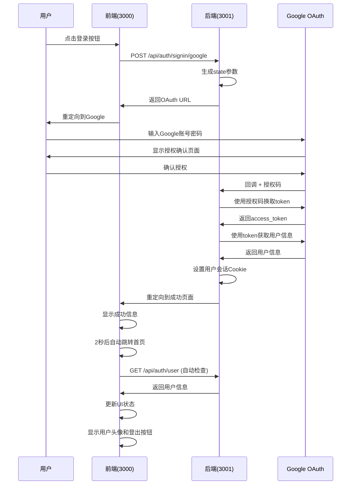

# OAuth技术实现指南

## 📋 目录
- [概述](#概述)
- [系统架构](#系统架构)
- [技术实现](#技术实现)
- [API接口](#api接口)
- [安全机制](#安全机制)
- [错误处理](#错误处理)
- [部署配置](#部署配置)

## 🎯 概述

本文档详细描述了Sino Name项目Google OAuth认证系统的技术实现，包括架构设计、流程实现、安全机制和部署配置。

### 技术特点
- **自定义实现**: 完全自主实现的OAuth 2.0流程
- **前后端分离**: 前端(3000端口) + 后端(3001端口)
- **安全优先**: CSRF保护、状态验证、安全Cookie
- **用户体验**: 自动状态同步、智能重定向、错误处理

## 🏗️ 系统架构

### 整体架构
```
┌─────────────┐    ┌─────────────┐    ┌─────────────┐
│   前端      │    │   后端      │    │   Google   │
│ (端口3000)  │◄──►│ (端口3001)  │◄──►│   OAuth    │
└─────────────┘    └─────────────┘    └─────────────┘
```

### 组件架构
```
┌─────────────────────────────────────────────────────────────┐
│                        前端服务                             │
│                    (端口3000)                              │
│  ┌─────────────────┐  ┌─────────────────┐  ┌─────────────┐ │
│  │   用户界面      │  │   状态管理      │  │   OAuth页面 │ │
│  │   (首页)        │  │   (useAuth)     │  │ (成功/错误) │ │
│  └─────────────────┘  └─────────────────┘  └─────────────┘ │
└─────────────────────────────────────────────────────────────┘
```

## 🔄 技术实现

### 完整认证流程



### 实现细节

#### 1. 状态管理 (useAuth Hook)
```typescript
export const useAuth = () => {
  const [authState, setAuthState] = useState<AuthState>({
    user: null,
    loading: true,
    error: null
  });
  const [isPending, startTransition] = useTransition();

  // 安全的导航函数
  const safeNavigate = (url: string) => {
    startTransition(() => {
      window.location.href = url;
    });
  };

  return {
    ...authState,
    login,
    logout,
    refreshUser,
    isAuthenticated: !!authState.user,
    isPending
  };
};
```

#### 2. 安全导航实现
```typescript
// 使用useTransition避免渲染错误
const [isPending, startTransition] = useTransition();

const safeNavigate = (path: string) => {
  startTransition(() => {
    router.push(path);
  });
};
```

## 🔌 API接口

### 认证接口

#### 1. 登录接口
```bash
POST /api/auth/signin/google
```
**功能**: 启动Google OAuth登录流程
**请求体**: `{}`
**响应**:
```json
{
  "success": true,
  "redirectUrl": "https://accounts.google.com/oauth/authorize?...",
  "message": "OAuth授权URL已生成"
}
```

#### 2. 用户信息接口
```bash
GET /api/auth/user
```
**功能**: 获取当前登录用户信息

#### 3. 登出接口
```bash
POST /api/auth/logout
```
**功能**: 用户登出，清除会话

## 🔒 安全机制

### CSRF保护
- **state参数**: 随机生成的32位字符串
- **Cookie存储**: HttpOnly + SameSite=Lax
- **参数验证**: 回调时验证state与cookie是否匹配
- **过期时间**: 10分钟自动过期

### 会话安全
- **HttpOnly Cookie**: 防止XSS攻击
- **Base64编码**: 用户数据编码存储
- **过期管理**: 自动清理过期会话

## 🚨 错误处理

### 常见错误及解决方案

| 错误代码 | 错误描述 | 解决方案 |
|----------|----------|----------|
| `invalid_grant` | 授权码已过期或无效 | 重新登录 |
| `access_denied` | 用户拒绝授权 | 重新授权 |
| `redirect_uri_mismatch` | 重定向URI不匹配 | 检查Google Console配置 |

## ⚙️ 部署配置

### 环境变量配置
```bash
# Google OAuth配置
GOOGLE_CLIENT_ID=your_google_client_id
GOOGLE_CLIENT_SECRET=your_google_client_secret

# NextAuth配置
NEXTAUTH_URL=https://your-domain.com
NEXTAUTH_SECRET=your_nextauth_secret

# 前端配置
FRONTEND_BASE_URL=https://your-domain.com
```

### 生产环境注意事项
1. **HTTPS**: 必须使用HTTPS协议
2. **域名**: 确保域名配置正确
3. **Cookie**: 设置适当的Cookie安全属性
4. **日志**: 启用错误日志记录

## 🧪 测试和调试

### 测试脚本
```bash
# 执行完整API测试
./test-oauth-apis.sh

# 手动测试登录
curl -X POST http://localhost:3000/api/auth/signin/google \
  -H "Content-Type: application/json" \
  -d '{}'
```

### 调试工具
- **OAuth调试页面**: `/oauth-debug`
- **认证测试页面**: `/test-auth`
- **浏览器开发者工具**: Network、Console、Application面板

---

*本文档提供了Sino-Name项目OAuth系统的完整技术实现指南。*
